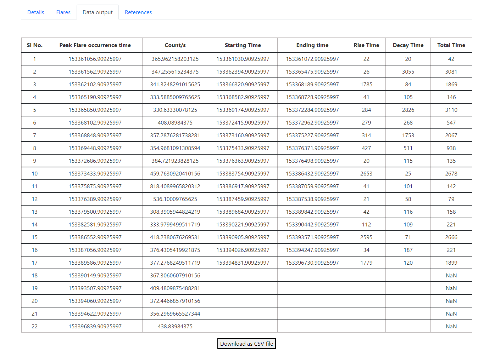

## **Solar X-ray Monitor and Data Analysis System**


> ISRO’s Web-Based Automatic Identification of Solar Bursts in X-RAY Light Curves\
> Project submission for Inter IIT Tech Meet 2022


It is a standalone web-based application to identify X-ray bursts and categorise them based on peak energy flux and temperature from the given X-ray light curves.
Parameters like peak occurence time, rise and decay time have been derived and made exportable as CSV. 
Main objecive is to browse XSM observations and visualise solar flares to facilitate research based on [ISRO's XSM data](https://pradan.issdc.gov.in/ch2/).

---





### Features:

- File upload option to analyse any .lc file
- Visualise and analyse light curve data from the ISRO datasets
- Identify solar flares and fit them to a curve
- Tabularize properties such as the duration of the burst, peak flare occurence count, etc.
- Export the data as CSV format for research purposes

---

## Installation Procedure:

#### Download the repository. Structure of the repository is shown below:

```
   MP-ISRO-T9
   |-- backend
   |-- frontend
```

---

#### **Run the backend :**

#### 1. Go to backend directory and install dependencies

```
cd backend

pip install -r requirements.txt
```

#### 2. Run the server

```
python app.py
```

#### **Run the frontend:**

#### 1. Go to frontend directory and install dependencies

```
cd frontend

npm install
```

#### 2. Run the server

```
npm start
```

Interface will be live at http://localhost:3000/

---

## Documentation & Code Explaination

Detailed explanation of the code is available in the attached PDF file : [MP_ISRO_Final_T9.pdf](https://github.com/SachinSahu431/Inter_IIT_ISRO/blob/main/frontend/src/static/User_Manual_T9.pdf)


## Meet the Team:

* <a href = "https://github.com/vaibhav-gelle" >Vaibhav Gelle </a>
* <a href = "https://github.com/nandysoham" >Soham Nandy </a>
* <a href = "https://github.com/devella1" >Devansh Verma </a>
* <a href = "https://github.com/SachinSahu431" >Sachin Kumar Sahu </a>
